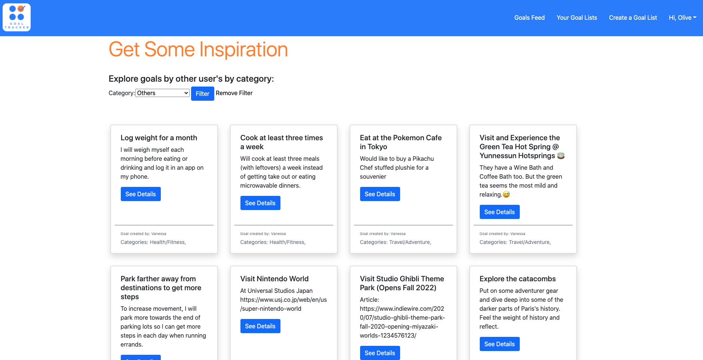
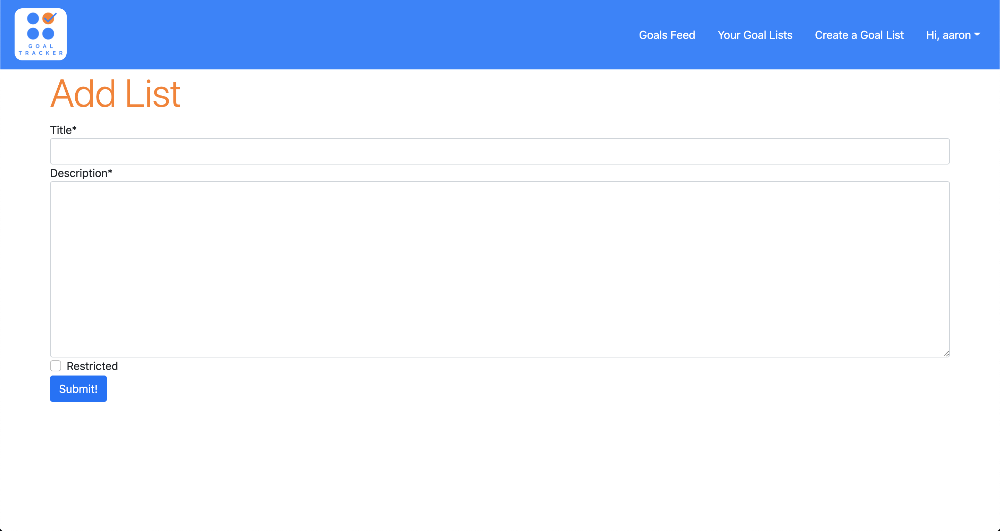
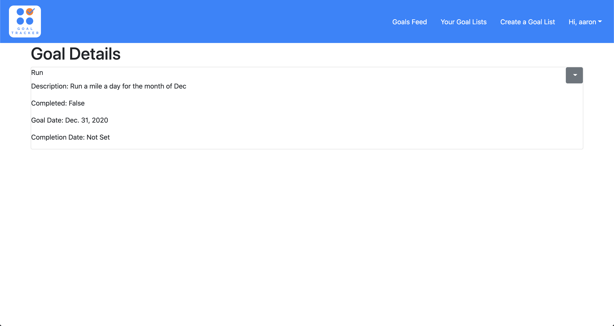

# Goal Tracker
Goal Tracker is an app that helps users manage, create, and stick to their goals and resolutions. Users can create their own lists (e.g. Bucket List, Fitness Goals, New Year's Resolutions), then organize goals amonst those lists. The New Year is the inspiration for this goals and resolutions app.

# Screenshots

# Technologies Used
* Python
* JavaScript
* Django
* PostgreSQL
* Github
* AWS
* Heroku
* HTML
* Bootstrap
* CSS

# Getting Started

Use Goal Tracker: http://goal-tracker-django.herokuapp.com/

Trello board: https://trello.com/b/ABDTKD4T/sei-project-3-goal-tracker-team-indecisive

Pitch-deck: https://docs.google.com/presentation/d/1ngBR0BKo9Oz9fx3WUNXNURBiAzmkwMneXufP64c72VU/edit#slide=id.ga8486af264_0_184

# Next Steps

* Users can navigate to other user's pages.
* Users can share lists and goals with other users.
* Users can check and uncheck a box to mark a goal as complete or incomplete from the Goal List Detail page.